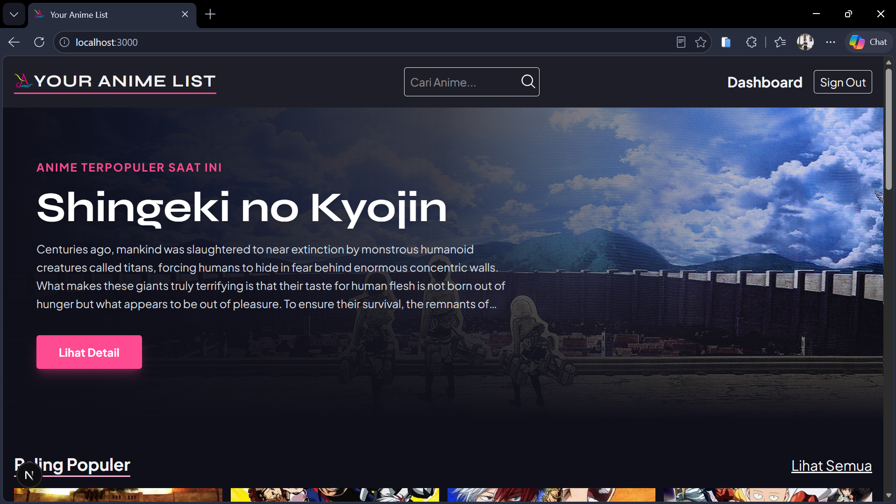

# Your Anime List

Aplikasi web untuk mencari, menyimpan, dan mendiskusikan anime favorit, dibangun secara full-stack menggunakan Next.js.  
Kunjungi: https://your-anime-list-pearl.vercel.app  

## Overview  
Sebuah project anime list yang dikerjakan dengan sepenuh hati untuk menjadi portofolio sekaligus media belajar dengan metode challenge-based learning. 



## Fitur Utama:  
1. Menampilkan informasi teraktual dari salah satu website anime terbesar dengan UI yang menarik dan mudah dipahami oleh setiap pengguna  
2. My collection untuk membantu user menyimpan koleksi animenya favoritnya secara terpusat  
3. Komentar supaya user bisa meninggalkan kesan dan pesan pada anime yang dikunjunginya dan sebagai media berinteraksi dengan pengguna lain  
4. Memiliki *error handling* (`try-catch`) dan validasi data yang ketat di setiap *endpoint* yang membutuhkan koneksi database, akan tetapi aplikasi akan tetap berjalan dengan normal(namun fitur collection & comment tidak tersedia) meskipun database MySQL sedang dalam keadaan *offline* atau terjadi gangguan server.

## Tech Stack

| Layer | Teknologi |
|---|---|
| Framework | Next.js (App Router) |
| Styling | Tailwind CSS |
| Database | MySQL (di-hosting via Aiven) |
| ORM | Prisma |
| Autentikasi | NextAuth.js — integrasi GitHub & Google OAuth |

Project ini dibangun di atas boilerplate [`create-next-app`](https://nextjs.org/docs/app/api-reference/cli/create-next-app).

## Menjalankan Secara Lokal

Ikuti langkah-langkah berikut untuk menjalankan project ini di mesin lokal Anda.

**1. Clone repository**
```bash
git clone https://github.com/sAndreas19/YourAnimeList.git
cd YourAnimeList
```

**2. Install dependencies**
```bash
npm install
```

**3. Siapkan environment variables**
```bash
cp .env.example .env
```
Lengkapi isi `.env` dengan:
- `DATABASE_URL` — koneksi ke database MySQL lokal Anda
- Client ID dan Client Secret dari GitHub OAuth serta Google OAuth

**4. Sinkronkan skema database**
```bash
npx prisma db push
```

**5. Jalankan development server**
```bash
npm run dev
```

Buka [http://localhost:3000](http://localhost:3000) di browser untuk melihat hasilnya.

## Rencana Pengembangan

- [ ] Filter dan sorting berdasarkan genre, status, dan rating
- [ ] Sistem rating, tidak hanya kolom komentar
- [ ] ...

[@sAndreas19](https://github.com/sAndreas19)